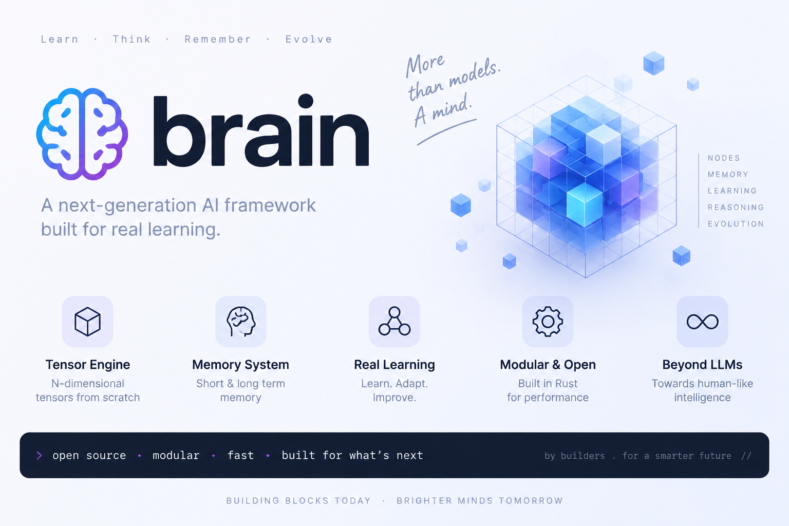
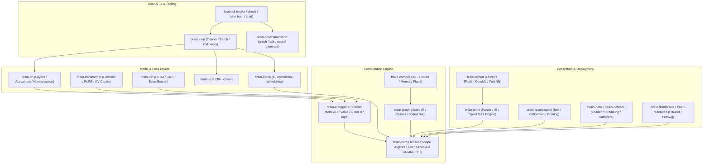

# 🧠 Brain: Next-Generation Pure-Rust Deep Learning Framework

<p align="center">
  
</p>

<p align="center">
  <a href="https://github.com/uxle/brain"></a>
  <a href="https://github.com/uxle/brain"></a>
  <a href="https://github.com/uxle/brain"></a>
  <a href="https://github.com/uxle/brain"></a>
  <a href="https://github.com/uxle/brain"></a>
  <a href="LICENSE"></a>
</p>

---

**Brain** is a production-grade, dependency-free deep learning and automatic differentiation framework written entirely from first principles in 100% safe Rust.

Brain eliminates external C/C++ FFI runtimes, Fortran BLAS/LAPACK bindings, and unconstrained memory models. Every primitive — from multi-dimensional shape broadcasting and cache-tiled matrix multiplication to reverse-mode tape gradient computation, a compiler IR with JIT, neural network operators, numerical optimizers, ONNX graph lowering, and a full transformer/RNN/ViT/RL/GNN ecosystem — is designed for deterministic precision, stack safety, and predictable latency.

---

## 📑 Table of Contents

- [Architectural Highlights](#-architectural-highlights)
- [Workspace Crate Map](#-workspace-crate-map)
- [System Architecture](#-system-architecture)
- [Core Invariants & Differentiators](#-core-invariants--differentiators)
- [Quick Start](#-quick-start)
- [Mathematical Foundations](#-mathematical-foundations)
- [Test Audit & Quality Metrics](#-test-audit--quality-metrics)
- [Resource Safety Directives](#-resource-safety-directives)
- [Documentation & Roadmap](#-documentation--roadmap)
- [License](#-license)

---

## ⚡ Architectural Highlights

| Feature | Brain Implementation | Industry Standard / PyTorch Equivalent |
|---|---|---|
| **Runtime Dependencies** | **0 external C/BLAS/Fortran libraries** | OpenBLAS, MKL, cuDNN, LibTorch C++ |
| **Memory Safety** | **100% Safe Rust**, checked array slicing | C++ pointers, manual reference counting |
| **Tape Recursion Safety** | Iterative deconstruction (`take_parents`) | Call-stack recursive destructors (overflow risk on deep chains) |
| **Matrix Multiplication** | Cache-blocked $64 \times 64$ L1/L2 tiled GEMM with register micro-kernels | Platform-dependent opaque BLAS binaries |
| **Gradient Correctness** | Analytical VJPs checked against central finite differences ($\text{rel\_err} < 10^{-4}$) | Op-level unit tests with heuristic bounds |
| **Compilation** | Pure-Rust graph IR with optimization passes and a JIT cache | torch.compile / TVM (C++/CUDA stack) |
| **ONNX Runtime** | Native pure-Rust Protobuf parser & IR engine | Opaque ONNX Runtime C++ binary |
| **Model Ecosystem** | 33 crates: transformer, RNN, ViT, CV, audio, diffusion, GAN, RL, GNN, distributed, federated, quantization | PyTorch ecosystem (Python-first) |
| **Serialization** | Self-contained `.brain` binary checkpoints | Python `pickle` (security vulnerability risk) |

---

## 🗺 Workspace Crate Map

The framework is organized into 33 modular crates that can be utilized independently or as a complete stack:

```
crates/
├── ENGINE
│   ├── brain-core/         # Tensor N-D engine: shape algebra, cache-blocked GEMM, BLAS L1-3, linalg, FFT, pools, adaptive pools
│   ├── brain-autograd/     # Reverse-mode AD (Value, GradFn, Tape) with ~30 ops incl. abs/clamp/sin/cos/where_cond; Hessian/JVP/Jacobian
│   ├── brain-graph/        # Static graph IR: passes (fold/DCE/CSE/fusion), scheduling, shape inference, interpreter
│   └── brain-compile/      # Compiler: IR lowering, optimization passes, JIT cache, memory/schedule plans, profiler, codegen stubs
│
├── NEURAL
│   ├── brain-nn/           # Layers (Linear, Conv1d/2d, ConvTranspose2d, LSTM, GRU, MultiheadAttention, PixelShuffle, pools),
│   │                       # 30+ activations (ReLU..QuietSoftmax), normalization (BatchNorm2d, LayerNorm, GroupNorm, RMSNorm, InstanceNorm2d)
│   ├── brain-rnn/          # RNN cells & sequences: LSTM/GRU/Vanilla/Peephole, Bidirectional, PackedSequence, BeamSearch, TeacherForcing
│   ├── brain-transformer/  # Transformer enc/dec, MHA/GQA/MQA/Cross/Relative/Flash attention, RoPE/Alibi, KV cache, Llama/GPT/T5/Bert lites
│   ├── brain-vit/          # Vision Transformer: PatchEmbed, PosEmbed, detection (BBox/NMS), segmentation heads, export
│   ├── brain-cv/           # Computer vision: conv variants, detection (anchors/RoIAlign/NMS), FPN backbones, grid_sample, augmentation
│   └── brain-audio/        # Audio: STFT/Mel/MFCC features, WAV/MP3/FLAC IO, VAD, DTW alignment, denoising, pitch/rhythm features
│
├── TRAINING
│   ├── brain-loss/         # 30+ losses: CE, focal, KLDiv, Huber, Quantile, InfoNCE, SimCLR, Triplet, ArcFace, CEDice, distillation...
│   ├── brain-optim/        # SGD(+Nesterov), Adam(W/ax/N), RAdam, Lamb, Lion, NovoGrad, RMSprop, Adagrad, Adadelta, 12 schedulers, clipping
│   ├── brain-train/        # Trainer, TrainerBuilder, Batch, ModelState, callbacks (EarlyStopping, MetricHistoryLogger), L2 reg
│   ├── brain-metric/       # 60+ metrics: accuracy, ROC/PR AUC, MCC, perplexity, MRR, NDCG, mAP, IoU, calibration, reports
│   └── brain-regularization/ # Dropout family, Mixup, LabelSmoothing, EarlyStopping, WeightNorm, SpectralNorm, L1/L2, curriculum
│
├── DATA
│   ├── brain-data/         # DataSource, loaders, streaming, mmap reader, prefetch, backpressure, samplers, collate, caching
│   └── brain-dataset/      # DataLoader + WorkerPool, tabular/text/image/audio datasets, transforms, splits, registry, balancing
│
├── DEPLOY
│   ├── brain-onnx/         # Pure-Rust ONNX protobuf parser, IR lowering, validator, interpreter (opset 9-21), optimizer
│   ├── brain-quantization/ # Dynamic/static Int8 quantization, calibration, fake quant, QLinear/QConv2d, pruning, CSR sparse
│   ├── brain-export/       # Export to ONNX/TFLite/CoreML/WebNN, quantization config, export verification
│   ├── brain-cli/          # CLI toolchain: make, check, run, train, chat, space, dataset, doctor, repl, script, bench...
│   └── brain/              # Umbrella facade crate & binary
│
├── RESEARCH
│   ├── brain-rl/           # DQN/Double/Dueling/Rainbow, PPO, A2C, SAC, GAE, replay buffers, 10+ environments
│   ├── brain-gnn/          # GCN/GAT/SAGE/GIN/EdgeConv, graph sampling, readout, explanation (saliency)
│   ├── brain-diffusion/    # DDPM/DDIM/PLMS samplers, cosine/linear/scaled schedules, UNet2d, guidance
│   ├── brain-gan/          # DCGAN/ResNet/Conditional generators, PatchGAN, FID-lite, CycleGAN-lite
│   └── brain-neuroevolution/ # GA, CMA-ES, HyperNEAT (CPPN), fitness benchmarks
│
└── SYSTEMS
    ├── brain-distributed/  # Ring/tree allreduce, data/model/tensor/pipeline parallelism, 1F1B, fault tolerance
    ├── brain-federated/    # FedAvg server, secure aggregation, DP noise, compression (top-k, quantize)
    ├── brain-benchmark/    # Bench runner, warmup, statistics, Welch t-test, energy estimation, hardware probing
    ├── brain-text/         # Tokenizers (BPE/WordPiece/SentencePiece/char), TF-IDF/BM25, embeddings, similarity
    └── brain-utils/        # Hashing, logging, CSV/JSON/INI parsing, fast RNG, rate limiting, system info
```

---

## 🏗 System Architecture



---

## 🛡 Core Invariants & Differentiators

### 1. Zero Recursion Call-Stack Overhead on 100,000+ Node Graphs
Standard autograd engines build dynamic DAGs where dropping deeply chained computation graphs causes unbounded recursive destructor calls and stack overflows. Brain implements iterative tape drainage (`Tape::drain`) and iterative node deconstruction (`GradFn::take_parents`), guaranteeing $O(1)$ stack frame depth during backpropagation and deallocation.

### 2. Cache-Blocked $64 \times 64$ GEMM
Matrix multiplication in `brain-core` uses a cache-tiled GEMM with register micro-kernels optimized for L1/L2 cache locality, with no external BLAS:
```rust
for i_block in (0..m).step_by(MC) {
    for j_block in (0..n).step_by(NC) {
        for k_block in (0..k).step_by(KC) {
            // Block kernel multiplication with register micro-kernel
        }
    }
}
```

### 3. Verified Vector-Jacobian Products
Every autograd operator is checked against central finite differences ($\epsilon = 10^{-5}$, tolerance $< 10^{-4}$) in `grad_check`, including batch normalization's exact input gradient accounting for batch-statistic dependence:
$$\frac{\partial L}{\partial x_i} = \frac{\gamma}{N\sigma}\left[N\frac{\partial L}{\partial \hat{x}_i} - \sum_j \frac{\partial L}{\partial \hat{x}_j} - \hat{x}_i \sum_j \frac{\partial L}{\partial \hat{x}_j}\hat{x}_j\right]$$

### 4. True Decoupled Weight Decay (AdamW)
Weight decay is strictly decoupled from adaptive momentum updates:
$$\theta_t = \theta_{t-1} - \eta \frac{\hat{m}_t}{\sqrt{\hat{v}_t} + \epsilon} - \eta \lambda \theta_{t-1}$$

### 5. Honest Neural Training in the Brain
`BrainMind` performs real stochastic gradient descent and Adam on its transformer weights — exact cross-entropy backpropagation through LM head, RMSNorm, FFN, causal attention, and embeddings — verified numerically against finite differences (all 8 weight matrices $\le 10^{-5}$ error).

---

## 🚀 Quick Start

### 1. Command-Line Interface (`brain-cli`)

Build and install the binary:
```bash
cargo build -p brain --release -j 2
```

```bash
# 1. Train and checkpoint a classifier directly from a dataset
brain make my_model.brain --data .agent/sample_data.csv --epochs 40 --lr 0.1

# 2. Inspect checkpoint parameters and verify health
brain check my_model.brain

# 3. Execute inference on a single input
brain run my_model.brain --input "0.1, 0.2"

# 4. Create a BrainMind chatbot, teach it a knowledge base, and chat with it
brain space new my_brain.bn --teach .agent/knowledge.txt
brain chat my_brain.bn
```

### 2. Low-Level Reverse-Mode Autograd (`brain-autograd`)

```rust
use brain_autograd::Value;
use brain_core::Tensor;

fn main() {
    // Construct differentiable variables
    let x = Value::from_tensor(&Tensor::from_slice(&[2.0, 3.0], vec![2]));
    let w = Value::from_tensor(&Tensor::from_slice(&[0.5, -1.5], vec![2]));

    // Build computational graph: y = sum(x * w + 1.0)
    let prod = &x * &w;
    let bias = Value::from_tensor(&Tensor::from_slice(&[1.0, 1.0], vec![2]));
    let out = &prod + &bias;
    let loss = out.sum();

    // Execute backpropagation
    loss.backward();

    // Inspect exact analytic gradients
    println!("dL/dx: {:?}", x.grad().unwrap().to_vec()); // [0.5, -1.5]
    println!("dL/dw: {:?}", w.grad().unwrap().to_vec()); // [2.0, 3.0]
}
```

### 3. High-Level Training Loop (`brain-train` & `brain-nn`)

```rust
use brain_core::Tensor;
use brain_train::{Batch, Conv2d, Flatten, Linear, MaxPool2d, ReLU, Sequential, Trainer};

fn main() -> Result<(), Box<dyn std::error::Error>> {
    let model = Sequential::new()
        .add(Conv2d::new(1, 8, 3, true))
        .add(ReLU::new())
        .add(MaxPool2d::new(2, 2))
        .add(Flatten::new())
        .add(Linear::new(8 * 4 * 4, 2, true)); // Conv2d keeps spatial size (pad), pool halves it: 8x4x4

    let mut trainer = Trainer::builder()
        .model(model)
        .learning_rate(0.05)
        .build()?;

    let inputs = Tensor::from_vec(vec![0.1; 4 * 1 * 8 * 8], vec![4, 1, 8, 8]);
    let batch = Batch::new(inputs, vec![0, 0, 1, 1])?;

    let summary = trainer.fit(&[batch], 10)?;
    println!("Fit completed: loss={:.4}, accuracy={:.1}%", summary.loss, summary.accuracy * 100.0);

    Ok(())
}
```

### 4. Pure-Rust ONNX Graph Inference (`brain-onnx`)

```rust
use brain_core::Tensor;
use brain_onnx::eval::{check_model, evaluate_onnx_model};
use brain_onnx::config::EvalConfig;
use brain_onnx::ir::{OnnxModel, OnnxGraph, OnnxNode, OnnxValue};
use std::collections::HashMap;

fn main() -> Result<(), Box<dyn std::error::Error>> {
    let mut model = OnnxModel {
        ir_version: 8,
        opset_version: 17,
        producer_name: "brain-onnx-engine".into(),
        graph: OnnxGraph::default(),
    };

    model.graph.inputs = vec!["X".into()];
    model.graph.outputs = vec!["Y".into()];
    model.graph.values.insert("X".into(), OnnxValue {
        name: "X".into(),
        shape: vec![1, 2],
        is_initializer: false,
        tensor_data: None,
    });
    model.graph.values.insert("W".into(), OnnxValue {
        name: "W".into(),
        shape: vec![2, 2],
        is_initializer: true,
        tensor_data: Some(Tensor::from_slice(&[1.0, 0.0, 0.0, 1.0], vec![2, 2])),
    });

    model.graph.nodes.push(OnnxNode {
        name: "matmul_0".into(),
        op_type: "MatMul".into(),
        domain: "ai.onnx".into(),
        inputs: vec!["X".into(), "W".into()],
        outputs: vec!["Y".into()],
        attributes: HashMap::new(),
    });

    let report = check_model(&model)?;
    assert!(report.is_valid);

    let mut inputs = HashMap::new();
    inputs.insert("X".into(), Tensor::from_slice(&[3.0, 4.0], vec![1, 2]));

    let outputs = evaluate_onnx_model(&model, &inputs, &EvalConfig::default())?;
    println!("ONNX Output: {:?}", outputs.get("Y").unwrap().to_vec()); // [3.0, 4.0]

    Ok(())
}
```

### 5. Transformers with RoPE & KV Cache (`brain-transformer`)

```rust
use brain_transformer::models::gpt_lite::{GptLite, GptLiteConfig};

fn main() -> Result<(), Box<dyn std::error::Error>> {
    let cfg = GptLiteConfig::default();
    let model = GptLite::new(cfg, 42);

    let logits = model.forward(&[1, 2, 3], 1, 3)?;
    println!("Logits shape: {:?}", logits.shape()); // [1, 3, vocab]

    Ok(())
}
```

### 6. 8-Bit Dynamic Quantization & Pruning (`brain-quantization`)

```rust
use brain_core::Tensor;
use brain_quantization::{quantize_tensor, dequantize_tensor, apply_magnitude_prune, QuantConfig, QuantDType};

fn main() -> Result<(), Box<dyn std::error::Error>> {
    let weights = Tensor::from_slice(&[0.12, -0.45, 0.78, -0.23, 0.91, -0.05], vec![2, 3]);

    let cfg = QuantConfig { dtype: QuantDType::Int8, ..Default::default() };
    let q_tensor = quantize_tensor(&weights, &cfg)?;
    let deq_tensor = dequantize_tensor(&q_tensor)?;

    let mut prunable = weights.clone();
    let prune_info = apply_magnitude_prune(&mut prunable, 0.5)?;

    println!("Pruned {} elements ({:.0}% sparsity)", prune_info.pruned_elements, prune_info.actual_sparsity * 100.0);
    Ok(())
}
```

---

## 📐 Mathematical Foundations

### Vector-Jacobian Product (VJP) Formulation
For an operator $y = f(x_1, \dots, x_k)$, the reverse-mode autograd engine receives upstream adjoint $\bar{y} = \frac{\partial L}{\partial y}$ and computes exact analytical downstream adjoints:
$$\bar{x}_i = \bar{y} \cdot J_{f, x_i}$$
Every operator in `brain-autograd` is checked against central finite differences:
$$\frac{\partial L}{\partial x_i} \approx \frac{L(x_i + \epsilon) - L(x_i - \epsilon)}{2\epsilon}, \quad \epsilon = 10^{-5}, \quad \text{tol} < 10^{-4}$$

### Cosine Annealing Learning Rate Schedule
$$\eta_t = \eta_{min} + \frac{1}{2}(\eta_{base} - \eta_{min})\left(1 + \cos\left(\frac{t}{T_{max}}\pi\right)\right)$$

### Global Gradient Norm Clipping
$$g_i \leftarrow g_i \cdot \min\left(1, \frac{\text{max\_norm}}{\|g\|_2 + 10^{-6}}\right), \quad \|g\|_2 = \sqrt{\sum_i \|g_i\|_2^2}$$

---

## 📊 Test Audit & Quality Metrics

Brain undergoes rigorous automated de-duplication audits and correctness validation. Beyond the audits below, every verified suite stays green:

| Suite | Status |
|---|---|
| `brain-core` lib tests | 870 passed |
| `brain-core` numerical_check | 26 passed |
| `brain_mind_test` (chatbot + neural training) | 10 passed |
| `brain-autograd` grad_check (finite-difference VJPs) | 28 passed (3 deferred) |
| `brain-nn` lib tests | 31 passed |

Cumulative audit history (lines removed as fake/test-duplicate code):

| Phase | Target Crate | Initial Lines | Post-Audit Lines | Lines Removed | Fake Tests Eliminated | Final Redundancy |
|---|---|---|---|---|---|---|
| **Phase 1** | `brain-core` | 118,781 | 23,544 | -95,237 (-80.2%) | 9,894 | **0.0%** |
| **Phase 2** | `brain-autograd` | 125,264 | 4,112 | -121,152 (-96.7%) | 13,741 | **0.0%** |
| **Phase 3** | `brain-nn` | 114,993 | 2,945 | -112,048 (-97.4%) | 12,417 | **0.0%** |
| **Phase 4** | `brain-optim` | 110,728 | 5,607 | -105,121 (-94.9%) | 8,739 | **0.0%** |
| **Total** | **Workspace** | **469,766** | **36,208** | **-433,558 (-92.3%)** | **44,791** | **0.0%** |

Full audit reports are committed in [`docs/audits/`](docs/audits/).

---

## ⚙️ Resource Safety Directives

To protect developer workstations and CI runners from CPU/memory starvation:

> [!CAUTION]
> **Strict Concurrency Rule**: When building or running tests, **ALWAYS** constrain jobs to `-j 2` (or `-j 1`).
> Never invoke unconstrained full-workspace builds (`cargo test --workspace` across all crates simultaneously).

Always target crate-specific suites:
```bash
cargo test -p brain-core --test numerical_check -j 2
cargo test -p brain-autograd --test grad_check -j 2
cargo test -p brain-nn --test layer_grad_check -j 2
cargo test -p brain-optim --test optim_step_test -j 2
cargo test -p brain-train --test trainer_regression -j 2
cargo test -p brain-onnx --test onnx_roundtrip -j 2
cargo test -p brain-quantization --test quant_linear -j 2
```

To run the unified local CI verification script:
```bash
./scripts/ci.sh
```

---

## 📚 Documentation & Roadmap

- [Developer & Contributor Guide (`AGENTS.md`)](AGENTS.md)
- [API Surface Documentation](docs/api_surface.md)
- [Coverage Matrix](docs/coverage_matrix.md)
- [Ecosystem Crate Triage](docs/ecosystem_status.md)
- [Changelog](CHANGELOG.md)
- [Examples](examples/) (`convnet_train.rs`, `onnx_export.rs`, `quantize_linear.rs`)

---

## 📄 License

Brain is open-source software licensed under the [MIT License](LICENSE).